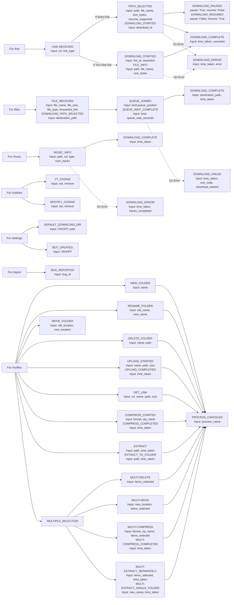

# 📊 System Logging & Event Lifecycle

- 🏠 [Home](../)
- 📊 [live_logs Table](logging.md)

This document maps out how our backend logging system tracks operations. Every user command triggers structured state transitions, capturing specific parameters (`Inputs`) to trace successes, failures, and cancellations.

---

## 🗺️ Visual Flowchart

---
